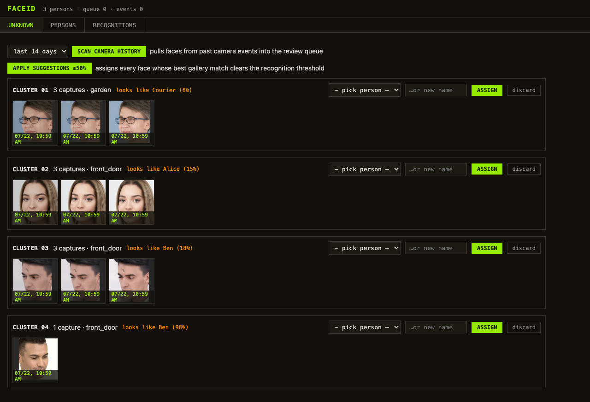
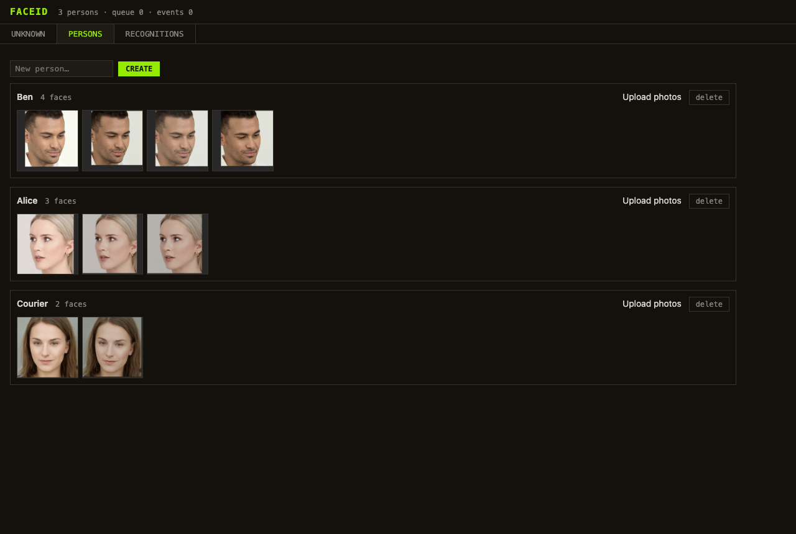

# FaceID — self-hosted face recognition for Frigate + Home Assistant

FaceID is a small, self-hosted service that adds **reliable, trainable face recognition**
on top of [Frigate](https://frigate.video). It uses the same model family as Immich and
CompreFace (**InsightFace `buffalo_l`**: SCRFD detection + ArcFace embeddings) and was
built because Frigate's built-in face recognition UX didn't cut it:

- **No train-tab treadmill.** Faces are matched by embedding similarity — every image you
  assign is a permanent reference point. No retraining, no overfitting, no queue that
  fills up with already-known faces.
- **Strangers are first-class.** Unknown faces are collected, **auto-clustered** (DBSCAN,
  the same trick photo apps use) and reviewed in a web UI: one click assigns a whole
  cluster to a person — or creates "Mailman" as its own person so he stops being matched
  to your family.
- **Train from anywhere.** Assign faces from your cameras, upload photos from your photo
  library, or enroll whole folders via CLI.
- **Home Assistant native.** MQTT discovery sensors per camera (presence-window state like
  `Alice, Bob` → `nobody`), plus a per-recognition event topic for automations.
- **Tags flow back to Frigate.** Recognized names are written as `sub_label`, so you can
  filter clips by person in Frigate's Explore view — including retroactively: the history
  scan tags past events, and assigning a face in the review UI tags its original event too.

## Screenshots

*All faces below are AI-generated (StyleGAN) — no real persons.*

**Unknown review** — new faces arrive auto-clustered; assign a whole cluster with one
click, or scan your camera history to bootstrap the gallery:



**Persons** — your gallery; upload photos or send faces back to review:



## How it works

```
Frigate --MQTT frigate/events--> FaceID
   ^                                |  snapshot.jpg?crop=1 (person crop)
   |                                v
   +--API sub_label---------- InsightFace buffalo_l -> cosine match vs. gallery
                                    |
        match >= 0.50 -> publish person + tag Frigate event
        below         -> review queue (clustered in the web UI)

MQTT -> Home Assistant:  sensor.faceid_<camera>  +  faceid/event (JSON)
```

## Local-only, and what gets downloaded

FaceID performs **all recognition locally on your hardware** — no cloud APIs, no
accounts, no telemetry. The only thing ever fetched from the internet is the open-source
recognition model itself, once, on first start:

- **What:** InsightFace `buffalo_l` model pack (SCRFD face detection + ArcFace
  recognition, the same open models Immich and CompreFace use)
- **From where:** the official [InsightFace GitHub release](https://github.com/deepinsight/insightface/releases/tag/v0.7)
- **Size:** ~300 MB, cached on disk afterwards (survives restarts and add-on updates)

After that download, FaceID works completely offline. Your camera images and face data
never leave your machine.

## Requirements

- Frigate 0.16+ (snapshot + sub_label APIs), reachable over HTTP
- An MQTT broker (the one Frigate already uses is fine)
- A CPU with AVX (any Intel/AMD from the last decade; ~1.5 GB RAM; no GPU needed).
  **Running HAOS/your host in a VM?** The default virtual CPU model (e.g. Proxmox `kvm64`)
  hides AVX — set the VM CPU type to `host` and cold-restart the VM, or the recognition
  runtime will refuse to start.

## Install as Home Assistant add-on (recommended for HAOS)

1. Settings → Add-ons → Add-on Store → ⋮ → **Repositories** → add
   `https://github.com/SkyTechNerds/faceid`
2. Install **FaceID**, set your Frigate URL in the options (MQTT is picked up
   automatically from the Mosquitto add-on) and start it.
3. Open the **FaceID** panel in the sidebar. First start downloads the model (~300 MB).

The add-on is built locally on your machine (amd64/aarch64). See
[faceid-addon/DOCS.md](faceid-addon/DOCS.md) for all options.

## Install standalone (LXC, VM, bare metal)

Tested on Debian 12/13 and Ubuntu 22.04+; any Linux with Python 3.10+ works.

**1. System packages**

```bash
apt install python3-venv python3-dev build-essential libglib2.0-0 libgl1 libxcb1 libgomp1
```

**2. Get the code and install the Python environment**

```bash
git clone https://github.com/SkyTechNerds/faceid /opt/faceid
cd /opt/faceid
python3 -m venv venv
venv/bin/pip install -r requirements.txt
```

**3. Configure**

```bash
cp docs/example-config.yaml config.yaml
nano config.yaml   # set: Frigate URL, MQTT host + credentials, your camera names
```

**4. Run as a service**

```bash
cp faceid.service /etc/systemd/system/
systemctl daemon-reload
systemctl enable --now faceid
```

**5. Verify**

The first start downloads the model pack (~300 MB, one time — see above). Follow the
log with `journalctl -u faceid -f` until you see `MQTT verbunden (Success)`, then open
`http://<host>:8600` and check that the header shows your person/queue counters.

## Getting started

1. **Scan your camera history** (optional but recommended): in the Unknown tab, click
   **"Scan camera history"** — faces from past Frigate events land in the review queue,
   pre-clustered per person, and already-known people are tagged in Frigate retroactively.
   (CLI alternative: `venv/bin/python -m app.backfill --days 14`)
2. **Assign clusters** in the UI (Unknown tab): pick a name per cluster — select individual
   tiles first if a cluster contains a stray face. The ⛶ button shows the full snapshot
   for context.
3. Once a few people exist, use **"apply suggestions"** to bulk-assign everything the
   gallery already recognizes with ≥ 50 % similarity. Repeat as the gallery grows.
4. Optionally upload 5–10 clear photos per person (Persons tab) as clean anchors, or
   enroll a folder: `venv/bin/python -m app.enroll "Alice" /path/to/photos`.

**Training tips:** camera snapshots beat photo-library images (same lens, angle and light
as at recognition time). Diversity beats volume. Create dedicated persons for regular
strangers (mailman, neighbors) instead of discarding them — that keeps them from being
force-matched to your family.

## Home Assistant

Sensors appear automatically via MQTT discovery (`sensor.faceid_<camera>` for every
camera in `discovery_cameras`). The state lists everyone recognized within
`presence_window` seconds (`Alice, Bob`), then falls back to `nobody`. Attributes carry
the person list and the last recognition (score, event id).

For automations, trigger on the `faceid/event` topic — one JSON message per
(Frigate event, person): see [docs/ha-automation-example.yaml](docs/ha-automation-example.yaml)
for a phone-notification automation with the Frigate snapshot attached.

## Security & privacy notes

- The web UI supports optional **HTTP Basic Auth** (`faceid.auth` in config.yaml) —
  strongly recommended for standalone installs; the HA add-on is protected by ingress
  and your Home Assistant login instead. Either way: it manages biometric data — keep
  it on a trusted LAN and don't expose port 8600 to the internet (Basic Auth without
  TLS is not internet-grade protection).
- All face data stays in `data/` on your host (JPEG crops + embeddings). Delete a person
  and their data is gone.
- Depending on where you live, informing household members/visitors about face
  recognition on your cameras may be legally required. Be a good human.

## Configuration reference

See [docs/example-config.yaml](docs/example-config.yaml) — every option is commented. The two knobs
that matter most:

| Option | Meaning |
|---|---|
| `match_threshold` (0.50) | raise if strangers get matched to known persons, lower if known persons end up in the review queue |
| `cluster_eps` (0.55) | raise to merge unknown clusters more aggressively, lower if different people land in one cluster |

## License

MIT
