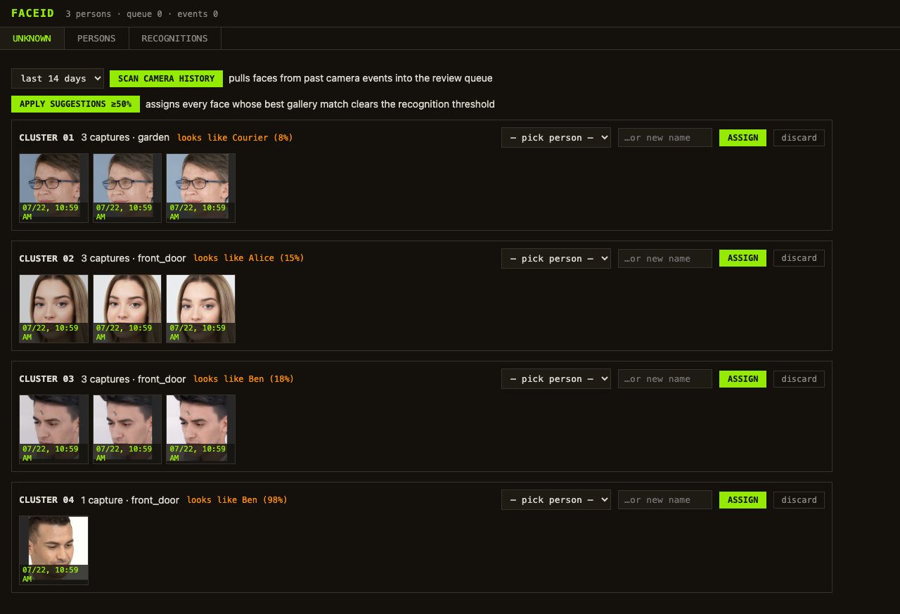
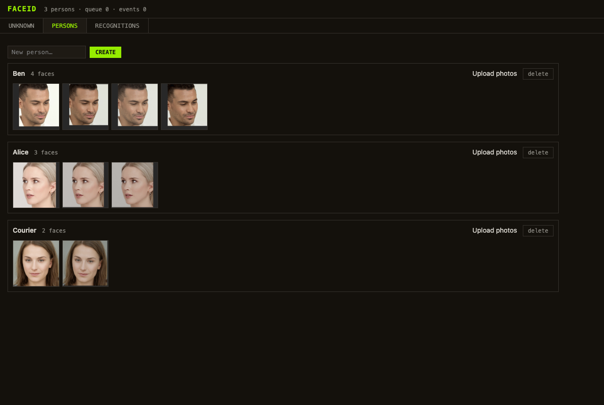

# FaceID — self-hosted face recognition for Frigate + Home Assistant

FaceID is a small, self-hosted service that adds **reliable, trainable face recognition**
on top of [Frigate](https://frigate.video). It uses the same model family as Immich and
CompreFace (**InsightFace `buffalo_l`**: SCRFD detection + ArcFace embeddings) and was
built because Frigate's built-in face recognition UX didn't cut it:

- **No train-tab treadmill.** Matching is nearest-neighbor over face embeddings — every
  image you assign is a visible reference point, with no training cycles and no queue
  that refills with already-known faces. To be clear: this is not immune to bad data —
  an imbalanced or mislabeled gallery still degrades matching (a person with many
  reference images wins borderline matches more often). The difference is that the
  failure mode is an image you can see and delete, not an opaque model update.
- **Strangers are first-class.** Unknown faces are collected, **auto-clustered** (DBSCAN,
  the same trick photo apps use) and reviewed in a web UI: one click assigns a whole
  cluster to a person — or **ignores** it. People you enroll (the mailman you *want*
  notifications for) get recognized; people you ignore go permanently silent.
- **An ignore list that actually sticks.** Ignored faces stay as *negative anchors*:
  never notified, never matched to your family, never resurfacing in review — and
  FaceID learns their new looks over time (only on unambiguous matches with a clear
  margin over every enrolled person, visibly marked "auto", deletable anytime).
  Anchors are grouped per person; groups can be merged, curated, or released into a
  real person with one click if you change your mind.
- **Train from anywhere, without bloat.** Assign faces from your cameras, upload photos
  from your photo library, or enroll whole folders via CLI. A per-person photo cap keeps
  galleries lean: when it's exceeded, the reference **most similar to the rest** is set
  aside (so unusual angles are kept, not lost) — visibly, on the person card, where you
  can restore it. The cap is adjustable in the Settings tab.
- **Home Assistant native.** MQTT discovery sensors per camera (presence-window state like
  `Alice, Bob` → `nobody`), plus a per-recognition event topic for automations.
- **Tags flow back to Frigate.** Recognized names are written as `sub_label`, so you can
  filter clips by person in Frigate's Explore view — including retroactively: the history
  scan tags past events, and assigning a face in the review UI tags its original event too.
- **Yours to keep.** A Settings tab holds the matching thresholds (live-editable) plus
  one-click **backup & restore** of your gallery, and an optional built-in **daily
  auto-backup** — your hand-curated face data is the one irreplaceable thing, so it's
  easy to safeguard.

## Screenshots

*All faces below are AI-generated (StyleGAN) — no real persons.*

**Unknown review** — new faces arrive auto-clustered; assign a whole cluster with one
click, or scan your camera history to bootstrap the gallery:



**Persons** — your gallery; upload photos, rename a person by clicking their name, or send
faces back to review:



## How it works

```
Frigate --MQTT frigate/events--> FaceID
   ^                                |  snapshot.jpg?crop=1 (person crop)
   |                                v
   +--API sub_label---------- InsightFace buffalo_l -> cosine match vs. gallery
                                    |
        match >= 0.50 -> publish person + tag Frigate event
        below         -> review queue (clustered in the web UI)

MQTT -> Home Assistant:  sensor.faceid_<camera>  +  faceid/event (JSON)
```

## Local-only, and what gets downloaded

FaceID performs **all recognition locally on your hardware** — no cloud APIs, no
accounts, no telemetry. The only thing ever fetched from the internet is the open-source
recognition model itself, once, on first start:

- **What:** InsightFace `buffalo_l` model pack (SCRFD face detection + ArcFace
  recognition, the same open models Immich and CompreFace use)
- **From where:** the official [InsightFace GitHub release](https://github.com/deepinsight/insightface/releases/tag/v0.7)
- **Size:** ~300 MB, cached on disk afterwards (survives restarts and app updates)

After that download, FaceID works completely offline. Your camera images and face data
never leave your machine.

## Requirements

- Frigate 0.16+ (snapshot + sub_label APIs), reachable over HTTP
- An MQTT broker (the one Frigate already uses is fine)
- A CPU with AVX (any Intel/AMD from the last decade; ~1.5 GB RAM; no GPU needed).
  **Running HAOS/your host in a VM?** The default virtual CPU model (e.g. Proxmox `kvm64`)
  hides AVX — set the VM CPU type to `host` and cold-restart the VM, or the recognition
  runtime will refuse to start.

## Install as a Home Assistant app (recommended for HAOS)

*(Apps were formerly known as apps.)*

1. Add this repository to your app store — one click:

   [](https://my.home-assistant.io/redirect/supervisor_add_addon_repository/?repository_url=https%3A%2F%2Fgithub.com%2FSkyTechNerds%2Ffaceid)

   (or manually: **Settings → Apps → App Store → ⋮ → Repositories** → add
   `https://github.com/SkyTechNerds/faceid`)
2. Install the **FaceID** app, set your Frigate URL in the options (MQTT is picked up
   automatically from the Mosquitto app) and start it.
3. Open the **FaceID** panel in the sidebar. First start downloads the model (~300 MB).

The app is built locally on your machine (amd64/aarch64). See
[faceid-addon/DOCS.md](faceid-addon/DOCS.md) for all options.

## Install standalone (LXC, VM, bare metal)

Tested on Debian 12/13 and Ubuntu 22.04+; any Linux with Python 3.10+ works.

**1. System packages**

```bash
apt install python3-venv python3-dev build-essential libglib2.0-0 libgl1 libxcb1 libgomp1
```

**2. Get the code and install the Python environment**

```bash
git clone https://github.com/SkyTechNerds/faceid /opt/faceid
cd /opt/faceid
python3 -m venv venv
venv/bin/pip install -r requirements.txt
```

**3. Configure**

```bash
cp docs/example-config.yaml config.yaml
nano config.yaml   # set: Frigate URL, MQTT host + credentials, your camera names
```

**4. Run as a service**

```bash
cp faceid.service /etc/systemd/system/
systemctl daemon-reload
systemctl enable --now faceid
```

**5. Verify**

The first start downloads the model pack (~300 MB, one time — see above). Follow the
log with `journalctl -u faceid -f` until you see `MQTT verbunden (Success)`, then open
`http://<host>:8600` and check that the header shows your person/queue counters.

## Getting started

1. **Scan your camera history** (optional but recommended): in the Unknown tab, click
   **"Scan camera history"** — faces from past Frigate events land in the review queue,
   pre-clustered per person, and already-known people are tagged in Frigate retroactively.
   (CLI alternative: `venv/bin/python -m app.backfill --days 14`)
2. **Assign clusters** in the UI (Unknown tab): pick a name per cluster — select individual
   tiles first if a cluster contains a stray face. The ⛶ button shows the full snapshot
   for context.
3. Once a few people exist, use **"apply suggestions"** to bulk-assign everything the
   gallery already recognizes with ≥ 50 % similarity. Repeat as the gallery grows.
4. Optionally upload 5–10 clear photos per person (Persons tab) as clean anchors. Photos
   with several people are handled: FaceID picks the face matching that person's existing
   references rather than the largest one, and skips the photo if none of them does. Or
   enroll a folder: `venv/bin/python -m app.enroll "Alice" /path/to/photos`.

## Ignoring people

Not everyone deserves a notification. FaceID distinguishes three actions on an unknown
face, and the difference matters:

| Action | Meaning |
|---|---|
| **Assign** | This is someone I track — recognize, notify, tag in Frigate |
| **Ignore** | I know who this is and never want to hear about them — silent forever |
| **Discard** | Garbage crop (blurry, not a face) — delete, no memory kept |

Ignored faces become negative anchors, grouped by person in the **Ignored** tab:

- Reappearances are silently dropped (a log line is all you get), and genuinely new
  looks are **auto-learned** into the right group — guarded so a household member can
  never silently become an anchor (requires high similarity *and* a clear margin over
  every enrolled person; auto anchors are marked and deletable). Opt out with
  `ignore_learning: false`.
- **Curate groups**: merge two groups when they're the same person, move selected
  anchors between groups, or send a face back to the review queue.
- **Change your mind**: release a whole group into an existing or brand-new person —
  the anchors become that person's reference gallery and tracking starts immediately.
- You can also ignore an entire enrolled person via **"ignore person"** on their card.

**Training tips:** camera snapshots beat photo-library images (same lens, angle and light
as at recognition time). Diversity beats volume. Create dedicated persons for regular
strangers (mailman, neighbors) instead of discarding them — that keeps them from being
force-matched to your family.

## Sharper reference photos

Frigate runs detection on a **downscaled** stream (often 1280x960 or even 640x360) but
records in **full camera resolution** (e.g. 2560x1920). Snapshots come from the detect
stream, so faces arrive smaller and softer than they need to be.

With **Settings → Sharper reference photos** enabled (default), a face heading for the
review queue is re-fetched from the *recording* instead: measured across a dozen real
events, faces came out roughly **twice as large** (e.g. 84px → 178px). Better references
mean better recognition — and, as a bonus, similarity scores spread out, making genuine
duplicates easy to tell from "same person, other angle".

Details: FaceID downloads the event clip once and scans frames across it, because Frigate
picks its snapshot from a moment that can't be queried afterwards. Every candidate face
is compared against the snapshot face and the best identity match wins — so with several
people in frame, the wrong face can't be enrolled. When no frame yields a usable face
(roughly one event in three), the original snapshot is kept.

Live recognition tries the fast snapshot path first; only when that yields nothing does it
fall back to a full-resolution frame — see
[docs/recognition-pipeline.md](docs/recognition-pipeline.md). Needs recordings enabled for
the camera.

## When the snapshot has no face

Frigate picks its snapshot by highest *person* score, which is not the same as "a face is
visible" — often it is the moment someone turns away. Measured over seven days of real
events, only **21%** of snapshots held a usable face.

FaceID therefore falls back, in order, and only when the step before found nothing:

| | source | when | cost |
|---|---|---|---|
| ① | Frigate snapshot | every event | already there |
| ② | live full-resolution frame via go2rtc | immediately, opt-in (`live_hires_fallback`) | ~1s |
| ③ | scan of the event recording | at event end (`clip_fallback`, on by default) | ~5–7s |

On the setup measured here this lifts usable events from a fifth to about four in five —
but the gain depends almost entirely on the **camera angle**, both fallbacks can be
limited per camera, and the live one needs go2rtc reachable on port 1984.

**→ [docs/recognition-pipeline.md](docs/recognition-pipeline.md)** covers the whole thing:
the measurements behind each stage, why cropping to the person box makes things *worse*,
how several people in one frame are handled, what it costs, and how to read the log.

### Recovering missed events

Sometimes the detect snapshot holds no usable face at all and the event is skipped
entirely. The history scan can go back over those via the clip:

```bash
python -m app.backfill --days 28 --rescue
```

About one in five such events yields a face this way. Because there is no snapshot face
to check identity against, the only guard is detection quality — and it has to be strict:
in a measured run, finds below ~0.8 were overwhelmingly back-of-head shots, motion blur
and false positives (a church spire scored 0.57), while finds above it were real faces.
The default is `--rescue-min-det 0.85`; lowering it multiplies the queue faster than it
adds usable references.

Expect a clip download (8–32 MB) and several seconds per affected event, so this is a
manual run, not something the live pipeline does.

**Keep `--days` within your recording retention.** Rescue needs the clip, so events older
than `record.retain` yield nothing and only cost time — a 28-day run against a 10-day
retention spends most of its hour on events it cannot help.

## Events MQTT never announces

FaceID listens on `frigate/events`. Events **created through Frigate's API** are not
tracked objects, so they never appear there — FaceID simply never learns about them.

This matters if you use a camera's own person detection as a reliability bridge: an
automation sees the camera report a person and creates a Frigate event for it. Those
events carry a snapshot and usually a clip, but stay invisible to FaceID.

Set `poll_interval` (seconds, e.g. `30`) to also poll Frigate's event API:

```yaml
faceid:
  poll_interval: 30
```

On one installation that added ~22 events a day at the front door, of which 12 in 20
held a usable face — roughly doubling what FaceID could learn from. Polled events run
through the same pipeline; they carry no bounding box, so their snapshot is the full
frame rather than a person crop. Off by default, since it costs one API request per
interval.

Setting up such a bridge, checking beforehand whether it pays off, and the pitfalls of
box-less snapshots: **[docs/camera-bridge.md](docs/camera-bridge.md)**.


## Calibrating the threshold

The defaults are deliberately cautious, and on a real gallery that caution turned out to
be expensive. Measure yours rather than guessing — `scripts/measure-recognition.py` and
`scripts/coverage.py` produce the numbers.

On a 128-photo household gallery the separation was far wider than the defaults assume:

| | correct person | someone else in the gallery |
|---|---|---|
| best match score | median 0.50 | median 0.18, **max 0.31** |

With a default threshold of 0.50 sitting exactly on the median of correct matches, half
of all genuine recognitions were discarded to keep a distance nothing ever came close to.
Two changes followed, both measured:

* **`match_top_k` 3 → 1.** Averaging the best k photos punishes people whose references
  cover many angles — their own less similar photos drag the score down, so the
  best-covered people scored worst.
* **`match_threshold` 0.50 → 0.45**, still 0.14 above the highest score any stranger
  ever reached.

Together these lifted recognition on a held-out set of real events from 90% to 100%, and
moved the weakest favourite's worst match from 0.01 above the cut-off to 0.09 above it —
without a single misassignment.

**In the UI:** Settings → *Does it actually work?* runs the same analysis as a background
job — no shell needed, which matters if you run FaceID as a Home Assistant app. The
scripts remain for scripted or comparative runs (`--baseline`, `--top-k`).

### Strangers are rarely the limit — the people you enrolled are

The obvious question is "how close does a stranger get?", and it is the wrong one to stop
at. Two numbers matter, and the **higher** of them sets your floor:

| | measured here |
|---|---|
| highest score a **stranger** reaches | 0.195 |
| highest score between two **enrolled** people | **0.411** |

Going by strangers alone, 0.25 would look safe. It is not: at 0.25 the two people in this
household who resemble each other most become interchangeable — a father and daughter whose
galleries overlap at 0.411. And a *wrong known name* is worse than no name at all, because
automations act on it, while "unknown" can simply be ignored.

This is why the analysis reports both, and why lowering the threshold because someone is
not being recognised is usually the wrong move. (One case where no threshold helps: **small
children** — a toddler's face is about half the size of an adult's and falls below
`min_face_px` at the same distance. See
[the pipeline doc](docs/recognition-pipeline.md#small-children-are-a-hard-case-not-a-tuning-problem).) If a person sits just below the line, the
fix is more reference photos of the situations they are actually seen in — that raises
*their* score without moving anyone else closer.

Do not copy any of these numbers. Measure your own gallery: Settings → *Does it actually
work?* reports the ceiling for both cases, and refuses to suggest lowering anything if it
finds a misassignment.

## Measuring instead of guessing

Three scripts answer the questions that otherwise invite guesswork:

```bash
python scripts/why-no-face.py --days 7 --clip 12   # why do events yield no face?
python scripts/coverage.py                         # what is each person missing?
python scripts/measure-recognition.py --baseline /tmp/old --days 3
```

Start with `why-no-face.py` if recognition feels rare. It counts *why* events are
discarded — no face at all, too small, no snapshot — and separates the hopeless cases
(person too far away) from the recoverable ones (the snapshot moment was bad). With
`--clip` it re-checks discarded events against the recording, which tells you what
`clip_fallback` is worth **on your cameras** rather than on mine. Most "it barely
recognises anyone" reports turn out not to be gallery problems at all.

`coverage.py` reports, per person: photo count, diversity, viewing angles from the
landmarks, which cameras she was enrolled from, greyscale/IR shots, and a leave-one-out
self test — then names the concrete gap.

`measure-recognition.py` compares the current gallery against an older one (unpack a
backup from `data/backups`) and adds a practical probe against recent Frigate events,
including how much headroom each recognition has above the threshold. Events whose face
is already in the gallery are excluded — they score ~1.0 and measure nothing.

**Running FaceID as a Home Assistant app?** You have no shell, so the part that decides
your threshold was moved into the UI: Settings → *Does it actually work?* runs the
leave-one-out test and the practical probe as a background job and reports the one number
that matters, how high a stranger got. That covers threshold and `match_top_k`.

Two things still need a shell, and neither is required to run FaceID well:

* the **coverage report** (`coverage.py`) — which angles, cameras and IR shots each
  person is missing
* **comparing two galleries** (`--baseline`) — useful after a round of enrolling, but the
  UI analysis already tells you where you stand today


## How training stays healthy

Recognition is only as good as the reference photos, so FaceID keeps galleries diverse
rather than large:

- **A successful recognition never adds a photo.** Recognising you at the door tags the
  Frigate event and updates the sensor — but the gallery stays untouched. This is
  deliberate: a gallery that grows from its own matches reinforces whatever it already
  believes, and a single wrong match would quietly breed more of the same. References
  only come from what *you* assign in the review queue, or upload yourself.

- **Ignore anchors can be capped too** (`max_ignore_anchors`). With `ignore_learning`
  switched on, every unambiguous ignore match adds an anchor, which grows without bound
  on a busy street. The cap drops the most redundant auto-learned anchor per group —
  never a manual one, and never by age, since an old anchor is exactly as valid as a new
  one and removing it would let that person resurface.
- **New photos are only kept if they add something** — a near-duplicate of one you
  already have is skipped.
- **A per-person cap** (default 40, adjustable in Settings) bounds how many references a
  person keeps. When exceeded, FaceID sets aside the photo that is **most similar to all
  the others** — i.e. the most redundant one — so a rare side/angle shot is preserved
  while a 30th near-identical front shot is the first to go.
- **Remove duplicates on demand**: even under the cap, near-identical photos add nothing.
  **Settings → Remove duplicates** finds both truly identical *images* (perceptual hash) and
  near-identical *faces* (embedding similarity) and sets them aside (live preview),
  keeping the gallery diverse — as a button, so you stay in control. (Camera crops score
  lower than phone photos, so useful sensitivity is ~0.60–0.70.)
- **Nothing vanishes silently**: trimmed photos appear on the person card with a short
  reason and a one-click **restore** (or delete), and the set-aside pile is itself capped
  (`trimmed_keep`) so it never grows without bound.

If someone is recognized poorly from a certain angle, just add a photo from *that* angle —
being unusual, it's automatically kept.

**Full details:** [docs/trimming.md](docs/trimming.md) explains the why, the exact
selection rule (with numbers), and how to restore or curate set-aside photos.

## Connecting to Frigate

By default FaceID uses Frigate's API on **port 5000**, which is unauthenticated — fine on
a trusted LAN, and it needs no configuration. Frigate also serves an authenticated API on
port 8971:

```yaml
frigate:
  url: https://192.168.1.10:8971
  user: faceid
  password: secret
  verify_tls: false     # Frigate's default certificate is self-signed
```

One thing to know before you switch, measured rather than assumed: a `viewer` account can
read everything FaceID needs, but **cannot write `sub_label`** back into Frigate
(`Role viewer not authorized. Required: admin`). So authenticating costs you either the
names in Frigate's Explore view, or requires admin credentials in a config file.

Trade-offs, TLS, what FaceID actually requests, and which setup fits which network:
**[docs/frigate-connection.md](docs/frigate-connection.md)**.

## Seeing what it is doing

The **LOG tab** shows the last 500 log lines straight in the UI — including the quiet
cases that decide whether a setup works: whether Frigate answers at startup, which
cameras were announced to Home Assistant, and for every event whether a face was found
at all. If nothing is ever recognised, that tab usually says why within a few lines.
There is a warnings-only filter and a copy button for pasting into an issue.

## Backup & restore

Your gallery (enrolled persons + ignore anchors) is the one thing you can't regenerate —
so FaceID makes it easy to keep. Everything is on the **Settings** tab:

- **Download backup** — a `.tar.gz` of `persons/` + `ignored/` (not the unknown queue).
- **Restore** — *replace* everything, or *merge* in only what's missing (handy for moving
  people between instances).
- **Automatic daily backup** — enable it, pick an hour and how many to keep. It runs
  inside FaceID (no external cron needed); the folder defaults to `data/backups`, which
  survives app updates. Point it at a mounted share to get backups off the box.

**Automate it yourself** if you prefer: the download is a plain endpoint, so any host
cron or Home Assistant automation can pull it:

```bash
# nightly host cron — keep 14 days
curl -fsS http://<faceid-host>:8600/api/backup -o /backups/faceid-$(date +\%F).tar.gz
find /backups -name 'faceid-*.tar.gz' -mtime +14 -delete
```

Settings changed here (thresholds + backup) are stored in `data/settings.json` and
**override `config.yaml` / app options**, persisting across restarts and updates.

## Home Assistant

Sensors appear automatically via MQTT discovery (`sensor.faceid_<camera>` for every
camera in `discovery_cameras`). The state lists everyone recognized within
`presence_window` seconds (`Alice, Bob`), then falls back to `nobody`. Attributes carry
the person list and the last recognition (score, event id).

For automations, trigger on the `faceid/event` topic — one JSON message per
(Frigate event, person): see [docs/ha-automation-example.yaml](docs/ha-automation-example.yaml)
for a phone-notification automation with the Frigate snapshot attached.

## Updates

- **Home Assistant app:** you get notified automatically when a new version is available
  (Settings → Apps → FaceID → Update). The changelog is shown right in the update dialog.
- **Standalone:** `cd /opt/faceid && git pull && systemctl restart faceid`. Watch the
  GitHub releases to get notified.

See [CHANGELOG.md](CHANGELOG.md) for the full history.

## Security & privacy notes

- The web UI supports optional **HTTP Basic Auth** (`faceid.auth` in config.yaml) —
  strongly recommended for standalone installs; the HA app is protected by ingress
  and your Home Assistant login instead. Either way: it manages biometric data — keep
  it on a trusted LAN and don't expose port 8600 to the internet (Basic Auth without
  TLS is not internet-grade protection).
- All face data stays in `data/` on your host (JPEG crops + embeddings). Delete a person
  and their data is gone.
- Depending on where you live, informing household members/visitors about face
  recognition on your cameras may be legally required. Be a good human.

## Configuration reference

See [docs/example-config.yaml](docs/example-config.yaml) — every option is commented. The two knobs
that matter most:

| Option | Meaning |
|---|---|
| `match_threshold` (0.50) | raise if strangers get matched to known persons, lower if known persons end up in the review queue |
| `cluster_eps` (0.55) | raise to merge unknown clusters more aggressively, lower if different people land in one cluster |
| `match_top_k` (3) | a person's score is the mean of their top-k reference similarities — dampens photo-count bias (1 = raw max) |
| `max_faces_per_person` (40) | soft cap; adding more drops the most redundant reference (0 = unlimited) |
| `cross_risk_margin` (0.05) | a reference closer than `match_threshold` minus this to **another** person is set aside — such photos make two people confusable ([details](docs/trimming.md#references-that-make-two-people-confusable)); `-1` disables the check |
| `ignore_threshold` (= match_threshold) | similarity at which a face counts as ignored |
| `ignore_learning` (true) | learn new looks of ignored people as additional anchors (guarded) |
| `hires_enroll` (true) | fetch new review-queue faces from the recording (sharper references) |
| `clip_fallback` (true) | when a snapshot yields no face at all, scan the recording — on most setups the single biggest gain, see [the pipeline doc](docs/recognition-pipeline.md) |
| `clip_fallback_cameras` (all) | restrict the fallback to cameras where it actually pays off — the gain depends on the camera angle |
| `live_hires_fallback` (false) | on a failed snapshot, ask go2rtc for a full-resolution frame right away instead of waiting for the event to end ([details](docs/recognition-pipeline.md)) |
| `live_hires_fallback_cameras` (all) | restrict that to specific cameras |
| `live_hires_mode` (fallback) | `always` scans the full frame on every event instead of only after a failed snapshot — measure first, it found nothing extra here |
| `clip_fallback_frames` (12) | how many frames to sample from the clip |
| `clip_fallback_retries` (3) | retries when the clip is not finalised yet — without them roughly one scan in four is lost |
| `clip_fallback_min_det` (0.65) | detection score a clip frame must reach — stricter than the snapshot path, because there are twelve frames to choose from |
| `poll_interval` (0) | seconds; >0 also polls Frigate's event API for events MQTT never announces |

## License

MIT
